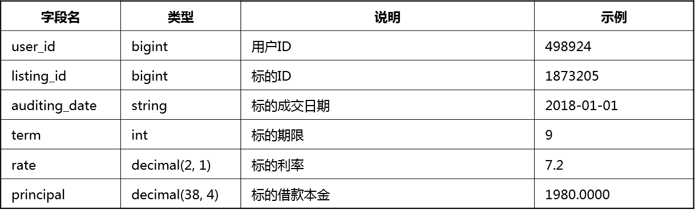
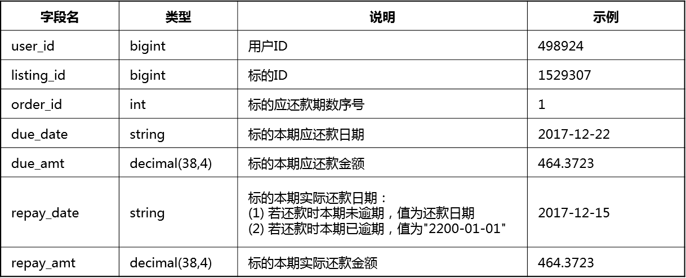
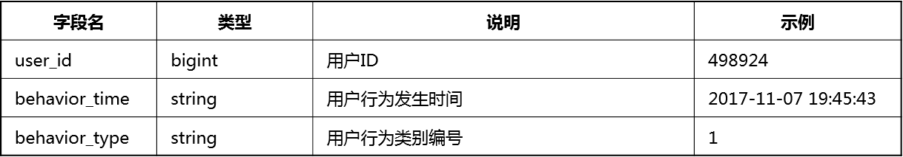
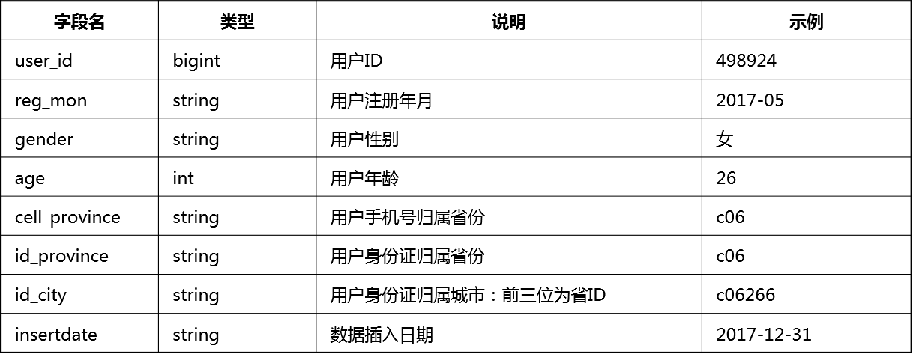
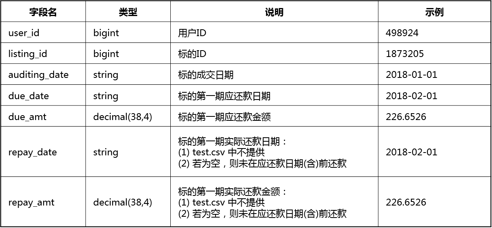
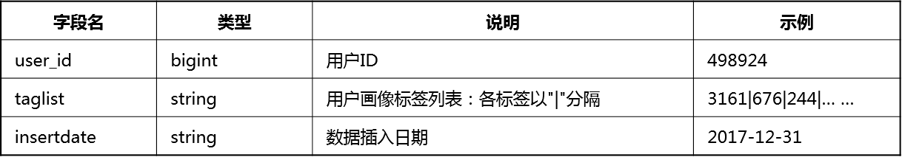
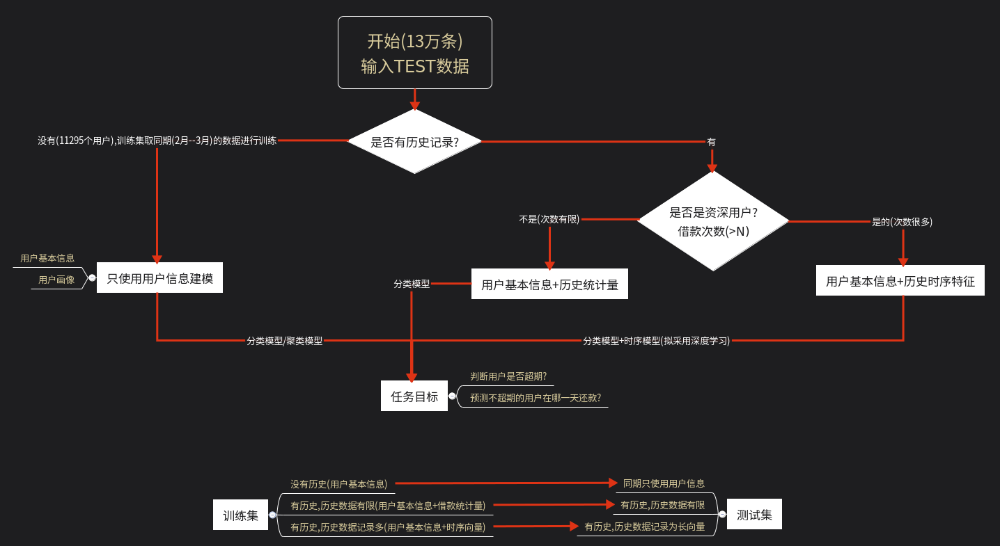

## 第四届魔镜杯大赛
### 一. 赛题

#### 1.介绍

```
资金流动性管理迄今仍是金融领域的经典问题。在互联网金融信贷业务中，单个资产标的金额小且复杂多样，对于拥有大量出借资金的金融机构或散户而言，资金管理压力巨大，精准地预测出借资金的流动情况变得尤为重要。本次比赛以互联网金融信贷业务为背景，以《现金流预测》为题，希望选手能够利用我们提供的数据，精准地预测资产组合在未来一段时间内每日的回款金额。

本赛题涵盖了信贷违约预测、现金流预测等金融领域常见问题，同时又是复杂的时序问题和多目标预测问题。希望参赛者利用聪明才智把互联网金融的数据优势转化为行业解决方案。
```

#### 2.结果


```
提交数据说明：

每个标的可有一条或多条预测结果，但必须保证：

(1) 预测的还款日期（repay_date）不重复，并且不早于成交日期（auditing_date）和不晚于应还款日期（due_date）；

(2) 预测的还款金额（repay_amt）为非负数，且总金额不超过其应还款金额（due_amt）；

(3) 若判定某个标的（listing_id）不会在应还款日期（due_date）(含)前还款，则在结果文件中该标的（listing_id）应仅存在一条记录，并且预测的还款日期和金额（repay_date和repay_amt）都为空
```

#### 3.评估指标

```
在本次比赛中，参赛队伍需要预测测试集中所有标的在成交日至第1期应还款日内日的回款金额，预测金额数据应为非负数且保留四位小数。本次比赛主要期望选手对未知资产组合每日总回款金额数据预测得越准越好，因此，不会给出标的归属资产组合序号，并选用RMSE作为评估指标，计算公式如下：
```


案例:


#### 4.数据:

- 标的属性表（listing_info.csv）



- 样本集（train.csv和test.csv）



- **借款用户操作行为日志表（user_behavior_logs.csv）**



- 用户信息表



- **用户还款日志表（user_repay_logs.csv）**



- 用户画像



### 二. 解决思路

#### 1.二分类模型

使用二分类模型来判断是否逾期,绘制混淆矩阵

#### 2.多分类模型用来判断还款的具体天数

- 目标:距离due_day的天数
  - 存在的问题是月大月小的问题,但是借贷还款的还款日大部分是基于每个月的多少号!
  - 以上的解决方案: `在特征中加入借款的月份,2019年要和2018年同期的进行标定`
  - 从还款的心理上,我认为手头的钱只有在最后的due_day才忍心给出去
  - 从借款平台的机制上来说,不会钱借出去后就找用户进行还款,总是在接近还款日的附近给一个短信或者邮件提醒.
- 特征构建
  - 用户基本信息(数值化)
  - 用户画像(聚类完成)
  - 借款月份(主要是为了和表现出同期的问题)
  - 借款的数额(频率,均值,方差)
  - 借款的次数(from repay_log)
  - 还款的天数(from repay_log)

#### 3.对用户进行分层次处理,使用不同的模型进行预测



### 三.TO DO LIST

- [x] 训练全部train数据,目标使用距离auditing date的天数
- [ ] 训练全部train数据,目标使用距离due date的天数,数据将用户的user_id编码后的加入
- [ ] 训练全部train数据,目标是预测用户是否存在逾期的行为(训练完后,删除submission中逾期的标)--------------->数据存在不均衡的情况

- [ ] 训练2018年同时期的14万条数据,包含统计信息----------->对于全部的数据进行预测
- [ ] 训练2018年同时期的14万条数据,只使用用户信息----------->对没有历史记录的用户进行预测
- [ ] 寻找test中的资深老用户,找出train中的资深老用户---------------->使用时序模型进行预测